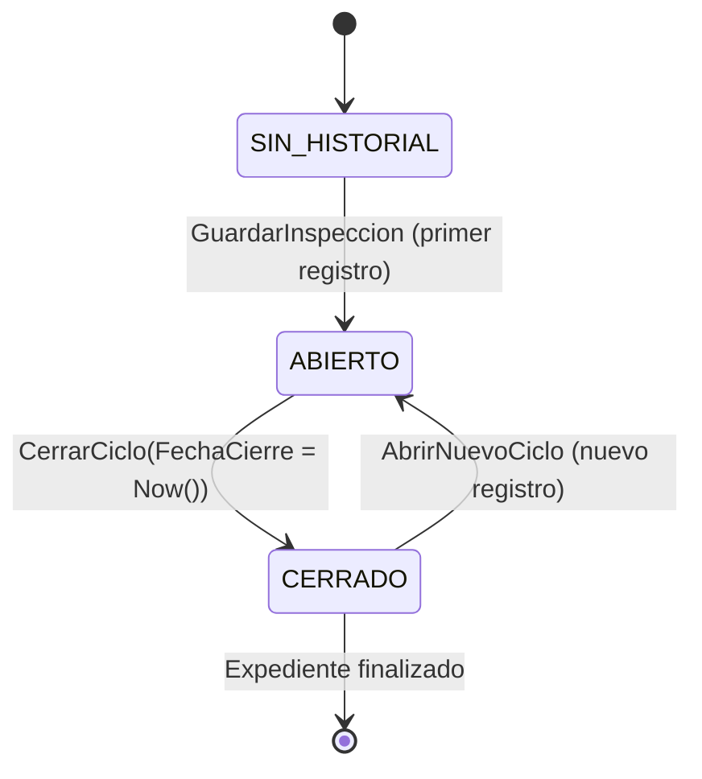
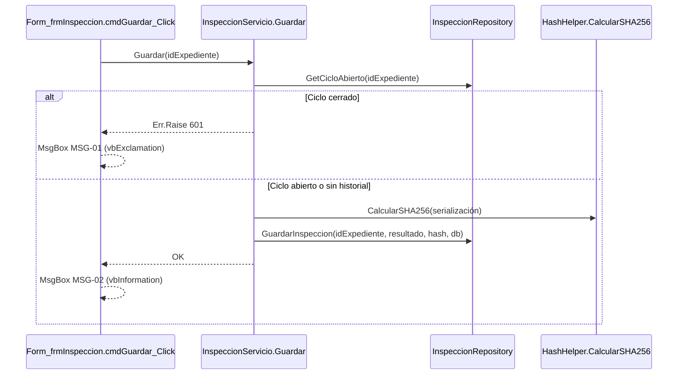

# Plantilla PRD — Referencia completa (VBA/Access genérica)

> **Instrucciones**: Este documento define la estructura obligatoria de todo PRD en proyectos VBA/Access.
> Cada sección incluye: qué contiene, por qué es necesaria, y un ejemplo con datos ficticios reutilizables.
> La IA debe leer este documento completo **y** el `project_context.md` del proyecto antes de escribir cualquier PRD.
> El `project_context.md` provee el vocabulario concreto (nombres de módulos, tablas, formularios) del proyecto actual.

---

## Estructura de secciones (obligatoria, en este orden)

```
0.  User Stories (siempre obligatorio)
1.  Objetivo
2.  Entidades y Tabla Fuente de Verdad
3.  UX / Flujo de Interfaz
4.  Reglas de Negocio / Ciclo de Vida
5.  Algoritmos y Lógica No Trivial (si aplica)
6.  Flujos Principales
7.  Transaccionalidad (si aplica)
8.  Pestañas / Secciones funcionales (si aplica)
9.  Fases alternativas o secundarias (si aplica)
10. Casos borde
11. Puntos de integración
12. Casos de prueba (Given-When-Then)
13. Registro de Deuda Técnica
```

No todas las secciones aplican a todos los PRDs. Si una sección no aplica, **omitirla** (no dejar secciones vacías).
Las secciones 0, 1, 2, 6, 10, 11, 12 y 13 son **siempre obligatorias**.

> **Nota de numeración**: Las secciones se numeran **siempre del 0 al 13** en el índice. En el cuerpo del PRD,
> usar el mismo número que en el índice. **No renumerar aunque se omitan secciones opcionales.**

---

## Sección 0 — User Stories

**Qué contiene**: Historias de usuario que describen la funcionalidad desde la perspectiva del usuario final.

**Por qué**: Son el puente entre los requisitos de negocio y la implementación técnica. La IA implementadora
necesita entender el *para qué* antes del *cómo*.

**Contenido obligatorio**:
- Mínimo 1 User Story principal que describa el caso de uso central.
- User Stories adicionales para flujos alternativos o casos especiales.
- Para cada User Story: título, descripción y criterios de aceptación medibles.

**Formato**:
```markdown
## 0. User Stories

### US-01: [Título corto descriptivo]
**Como** [rol de usuario]
**Quiero** [acción que desea realizar]
**Para** [beneficio o valor que obtiene]

**Criterios de aceptación:**
- [ ] [Criterio medible 1]
- [ ] [Criterio medible 2]
- [ ] [Criterio medible 3]
```

**Ejemplo**:
```markdown
## 0. User Stories

### US-01: Registrar resultado de inspección
**Como** técnico de calidad
**Quiero** registrar el resultado de una inspección con su fecha y observaciones
**Para** que quede trazabilidad del proceso de control de calidad

**Criterios de aceptación:**
- [ ] Se registran: fecha, resultado (CONFORME/NO CONFORME), técnico responsable y observaciones
- [ ] El resultado queda vinculado al expediente correspondiente
- [ ] No se puede guardar sin seleccionar resultado

### US-02: Bloquear doble registro en el mismo ciclo
**Como** técnico de calidad
**Quiero** que el sistema me avise si intento registrar una inspección sobre un ciclo ya cerrado
**Para** evitar duplicidades en el historial de inspecciones

**Criterios de aceptación:**
- [ ] Si el ciclo está cerrado, se muestra aviso y se bloquea el guardado
- [ ] El usuario puede ver el registro existente antes de decidir
```

---

## Sección 1 — Objetivo

**Qué contiene**: Una frase que describe qué funcionalidad documenta el PRD y qué flujos cubre.
Incluir también qué queda **fuera de alcance** si puede generar confusión.

**Por qué**: Una IA que lee el PRD debe saber en 5 segundos si es el documento correcto para su tarea.

**Ejemplo**:
```markdown
## 1. Objetivo
Definir el flujo operativo y transaccional del **registro de inspecciones de calidad**,
incluyendo la validación de ciclo abierto, el guardado atómico de datos y la generación
del informe de resultados.

**Fuera de alcance**: La firma digital del informe se documenta en PRD-08.
```

---

## Sección 2 — Entidades y Tabla Fuente de Verdad

**Qué contiene**:
- Tabla principal de la funcionalidad con **todos sus campos**.
- Para cada campo: tipo Access, si admite nulos, valor por defecto, PK/FK/índice.
- FK documentadas como `FK → tbTablaDestino.CampoDestino` (no solo el tipo).
- Valores enumerados para campos Text que actúan como enum.
- Firmas de los métodos de acceso principales (repositorio).
- Notas de inconsistencia si las hay.

**Por qué**: La IA necesita el esquema exacto para escribir SQL, validaciones y mapeos.
Sin tipos, adivina y se equivoca. Sin valores enumerados, puede pasar strings inválidos.
Sin las FK explícitas, no puede validar integridad referencial.

**Formato de tabla de campos**:
```markdown
| Campo | Tipo Access | Nulos | Default | PK/Índice |
| :--- | :--- | :--- | :--- | :--- |
| `Id` | Long | No | — | PK |
| `idExpediente` | Long | No | — | FK → tbExpedientes.Id |
| `Resultado` | Text(50) | No | `"PENDIENTE"` | — |
| `FechaInspeccion` | Date/Time | No | `Now()` | — |
| `Observaciones` | Memo | Sí | Null | — |
| `HashDatos` | Text(64) | Sí | Null | — |
```

**Valores enumerados**:
```markdown
`Resultado`: `"PENDIENTE"` | `"CONFORME"` | `"NO CONFORME"` | `"CANCELADO"`
```

**Formato de firmas de acceso**:
```markdown
- `InspeccionRepository.GetCicloAbierto(ByVal idExpediente As Long, Optional ByRef db As DAO.Database) → DAO.Recordset` (módulo `src/modules/InspeccionRepository.bas`)
- `InspeccionRepository.GuardarInspeccion(ByVal idExpediente As Long, ByVal resultado As String, ByRef db As DAO.Database) → Long` (módulo `src/modules/InspeccionRepository.bas`)
```

**Notas de inconsistencia** (si se detectan):
```markdown
⚠️ **INCONSISTENCIA**: `HashDatos` está definido como `Text(50)` en la BD pero SHA-256 requiere 64 caracteres.
Riesgo de truncamiento en registros existentes. Ver DT-05-001.
```

---

## Sección 3 — UX / Flujo de Interfaz

**Qué contiene**:
- Estados de UI relevantes con **texto literal** de los mensajes (MsgBox, labels).
- Controles de formulario con nombre exacto, tipo, formulario y evento.
- Flujo de interacción: qué ve el usuario, qué acciones toma, qué recibe.
- Accesibilidad: atajos de teclado, orden de Tab, íconos de MsgBox.

**Por qué**: Sin textos literales, la IA inventa mensajes que no coinciden con los ya existentes en el proyecto.
Sin los nombres exactos de controles, puede referenciar controles incorrectos o inexistentes.

**Formato de estados UI**:
```markdown
| Estado | Descripción | Mensaje mostrado (literal) | Acción del usuario |
| :--- | :--- | :--- | :--- |
| Happy Path | Guardado exitoso | `"Inspección registrada correctamente."` | Ninguna |
| Error — ciclo cerrado | Intento de guardar en ciclo cerrado | `"No se puede registrar: el ciclo ya está cerrado."` | Aceptar; no se guarda |
| Error crítico | Fallo interno | `"Error [nnn]: contacte con soporte."` | Cerrar formulario |
```

**Formato de mensajes**:
```markdown
| Código | Tipo | Texto literal | Ícono MsgBox | Acción tras cerrar |
| :--- | :--- | :--- | :--- | :--- |
| MSG-01 | Warning | `"No se puede registrar: el ciclo ya está cerrado."` | `vbExclamation` | Abortar guardado |
| MSG-02 | Éxito | `"Inspección registrada correctamente."` | `vbInformation` | Ninguna |
| MSG-03 | Error | `"Error [nnn]: contacte con soporte."` | `vbCritical` | Rollback implícito |
```

**Formato de controles de formulario**:
```markdown
| Control | Tipo | Formulario | Evento | Acción |
| :--- | :--- | :--- | :--- | :--- |
| `cmdGuardar` | CommandButton | `Form_frmInspeccion` | `Click` | Invoca `InspeccionServicio.Guardar` |
| `cmbResultado` | ComboBox | `Form_frmInspeccion` | `AfterUpdate` | Habilita `cmdGuardar` si hay selección |
| `txtObservaciones` | TextBox | `Form_frmInspeccion` | — | Entrada libre; admite Memo |
```

**Ejemplo completo**:
```markdown
## 3. UX / Flujo de Interfaz

### Estados UI
| Estado | Descripción | Mensaje mostrado (literal) | Acción del usuario |
| :--- | :--- | :--- | :--- |
| Happy Path | Guardado exitoso | `"Inspección registrada correctamente."` | Ninguna |
| Warning — ciclo cerrado | Intento de guardar en ciclo cerrado | `"No se puede registrar: el ciclo ya está cerrado."` | Aceptar |
| Error crítico | Fallo interno no controlado | `"Error [nnn]: contacte con soporte."` | Cierre del formulario |

### Mensajes de usuario
| Código | Tipo | Texto literal | Ícono | Acción tras cerrar |
| :--- | :--- | :--- | :--- | :--- |
| MSG-01 | Warning | `"No se puede registrar: el ciclo ya está cerrado."` | `vbExclamation` | Abortar |
| MSG-02 | Éxito | `"Inspección registrada correctamente."` | `vbInformation` | Ninguna |

### Controles de formulario
| Control | Tipo | Formulario | Evento | Acción |
| :--- | :--- | :--- | :--- | :--- |
| `cmdGuardar` | CommandButton | `Form_frmInspeccion` | `Click` | `InspeccionServicio.Guardar(idExpediente)` |
| `cmbResultado` | ComboBox | `Form_frmInspeccion` | `AfterUpdate` | Habilita `cmdGuardar` |
| `txtObservaciones` | TextBox | `Form_frmInspeccion` | — | Entrada libre |

### Accesibilidad
- Navegación por Tab orden estándar.
- MsgBox con íconos: `vbExclamation` para warnings, `vbCritical` para errores, `vbInformation` para éxito.
```

---

## Sección 4 — Reglas de Negocio / Ciclo de Vida

**Qué contiene**:
- Definición de estados con expresión SQL o VBA exacta.
- Qué se permite y qué se bloquea en cada estado (tabla).
- Diagrama de estados Mermaid (`stateDiagram-v2`) si hay ciclo de vida.

**Por qué**: La IA necesita las precondiciones y postcondiciones exactas de cada operación.
Sin esto, genera código que permite transiciones ilegales.

**Ejemplo**:
```markdown
## 4. Reglas de Negocio / Ciclo de Vida

### Definiciones
- **Ciclo abierto**: registro en `tbInspecciones` con `FechaCierre Is Null` para el `idExpediente` dado.
- **Sin historial**: no existe ningún registro en `tbInspecciones` para el `idExpediente`.
- **Ciclo cerrado**: `FechaCierre Is Not Null`.

### Permisos por estado
| Estado | Registrar inspección | Editar | Cerrar ciclo |
| :--- | :--- | :--- | :--- |
| Sin historial | ✅ (crea registro nuevo) | ❌ | ❌ |
| Ciclo abierto | ✅ (actualiza) | ✅ | ✅ |
| Ciclo cerrado | ❌ (MSG-01) | ❌ | ❌ |
```

**Ejemplo de diagrama de estados**:


---

## Sección 5 — Algoritmos y Lógica No Trivial

**Qué contiene** (solo si aplica):
- Función de hash/cifrado/serialización con firma completa.
- Orden exacto de campos en concatenación o serialización.
- Separadores, tratamiento de nulos, normalización de valores.
- Ejemplo literal con datos ficticios: cadena pre-procesada y resultado esperado.
- Notas de riesgo si el algoritmo tiene fragilidades conocidas.

**Por qué**: Los algoritmos de serialización son los puntos más frágiles del sistema.
Si la IA no sabe el orden exacto de campos o el tratamiento de nulos, cualquier cambio rompe la consistencia silenciosamente.

**Ejemplo**:
```markdown
## 5. Algoritmos y Lógica No Trivial

### 5.1 Algoritmo de hash para detección de cambios

**Función**
- `HashHelper.CalcularSHA256(ByVal texto As String) → String` (módulo `src/modules/HashHelper.bas`)
- SHA-256 vía CryptoAPI (advapi32.dll). Retorna hex en minúsculas, siempre 64 caracteres.
- Si `texto` está vacío, devuelve `""`.

**Serialización**
- Campos incluidos (en este orden): `idExpediente`, `resultado`, `observaciones`, `tecnico`
- Separador: `,` (coma sin espacios). Nombres de campo en `LCase`.
- Nulos → `Nz(..., "")` (cadena vacía). Strings → entrecomillados. Numéricos → sin comillas.

**Ejemplo literal**
- Entrada: `{ idExpediente: 7, resultado: "CONFORME", observaciones: null, tecnico: "García" }`
- Cadena serializada: `"idexpediente":7,"resultado":"CONFORME","observaciones":"","tecnico":"García"`
- SHA-256: `a3f1...9c20` (64 hex chars)

⚠️ RIESGO: El orden de campos está hardcodeado. Si se añade un campo a la tabla sin actualizar
la serialización, los hashes históricos y los nuevos serán incompatibles.
- Impacto: falsos positivos de "cambio detectado" o falsos negativos.
- Workaround: documentar cada adición de campo en `DEUDA_TECNICA.md` antes de aplicarla.
```

---

## Sección 6 — Flujos Principales

**Qué contiene**:
- Pasos numerados del flujo con firmas de los métodos que ejecutan cada paso.
- Evento de UI que inicia el flujo (nombre exacto del control, formulario y evento).
- Manejo de errores y rollback: qué pasa si falla cada paso, qué se muestra, qué se loguea.
- Diagrama de secuencia Mermaid con clases/métodos reales como participantes (no "Sistema → BD").

**Por qué**: Es el corazón del PRD. La IA lo usa para entender el orden de ejecución, qué método
llama a cuál, y cómo se manejan los errores en cada punto.

**Ejemplo**:
```markdown
## 6. Flujos Principales

### 6.1 Guardar inspección

**Evento de UI (entrada)**
- Botón `cmdGuardar` en `Form_frmInspeccion` → `Click` → `InspeccionServicio.Guardar(idExpediente)`.

**Pasos**
1. `InspeccionServicio.Guardar` llama a `InspeccionRepository.GetCicloAbierto(idExpediente)`.
2. Si ciclo cerrado → `Err.Raise 601` con mensaje MSG-01. Fin.
3. Calcular hash: `HashHelper.CalcularSHA256(SerializarInspeccion(idExpediente))`.
4. Si hash idéntico al último → no hacer nada (sin MsgBox; el guardado es idempotente).
5. `InspeccionRepository.GuardarInspeccion(idExpediente, resultado, hash, db)`.
6. Confirmar con MSG-02.

**Manejo de errores y rollback**
- En cualquier paso: `ws.Rollback` si transacción activa. `LogErrorUI` registra en `tbLogErrores`.
- `Err.Number = 601` → capturado en el formulario → muestra MSG-01 (`vbExclamation`).
- Otros errores → `ManejadorErroresFormulario` → `tbLogErrores`.
```

**Ejemplo de diagrama de secuencia**:


---

## Sección 7 — Transaccionalidad

**Qué contiene** (solo si la funcionalidad usa transacciones DAO):
- Regla de atomicidad: qué operaciones van juntas en una transacción.
- Patrón `BeginTrans` → operaciones → `CommitTrans` con código de ejemplo.
- Propagación de `db`: cómo se pasa por la cadena Form → Service → Repository.
- Puntos de entrada UI (formulario, control, evento concreto).
- Manejo de errores: `Rollback`, MsgBox, logging.

**Por qué**: Las transacciones son la fuente más común de bugs silenciosos en VBA/Access.
Si la IA no sabe qué operaciones deben ser atómicas, las implementa por separado y los datos quedan inconsistentes.

**Ejemplo**:
```markdown
## 7. Transaccionalidad

### Operaciones atómicas
`GuardarInspeccion` + `ActualizarEstadoExpediente` deben ser atómicas.
Si falla cualquiera de las dos, el expediente no debe quedar en estado inconsistente.

### Patrón
```vba
Dim ws As DAO.Workspace
Dim db As DAO.Database
Set ws = DBEngine.Workspaces(0)
Set db = ws.OpenDatabase(CurrentDb.Name)
ws.BeginTrans
    Call InspeccionRepository.GuardarInspeccion(idExpediente, resultado, hash, db)
    Call ExpedienteRepository.ActualizarEstado(idExpediente, "EN_REVISION", db)
ws.CommitTrans
' En error:
ws.Rollback
LogErrorUI "Guardar", Err.Number, Err.Description
```

### Puntos de entrada
- `Form_frmInspeccion.cmdGuardar_Click` → `InspeccionServicio.Guardar`
```

---

## Sección 8 — Pestañas / Secciones funcionales

**Qué contiene** (solo si hay subformularios o pestañas):
- Nombre exacto del control de pestañas y cada subformulario.
- Campos que pertenecen a cada sección.
- Método de guardado de cada pestaña.
- Dependencias entre pestañas (si la pestaña B requiere que A esté guardada).

**Por qué**: Sin este mapa, la IA puede asignar campos a la pestaña incorrecta o usar el método de guardado equivocado.

**Ejemplo**:
```markdown
## 8. Pestañas / Secciones funcionales

### Control de pestañas: `tabDatosInspeccion` en `Form_frmInspeccion`

| Pestaña | Índice | Subformulario | Campos clave | Método de guardado |
| :--- | :--- | :--- | :--- | :--- |
| Datos generales | 0 | `Form_subfrmDatosGenerales` | `cmbResultado`, `txtTecnico` | `InspeccionServicio.GuardarDatosGenerales` |
| Observaciones | 1 | `Form_subfrmObservaciones` | `txtObservaciones`, `chkRequiereAccion` | `InspeccionServicio.GuardarObservaciones` |
| Documentos | 2 | `Form_subfrmDocumentos` | `lstDocumentos` | `DocumentoServicio.VincularDocumento` |

**Dependencias**: La pestaña "Documentos" solo es editable si `Resultado ≠ null` (validado en `Form_Load`).
```

---

## Sección 9 — Fases alternativas o secundarias

**Qué contiene** (solo si hay más de un flujo principal):
- Misma estructura que la Sección 6: pasos, firmas, errores, diagrama propio.
- Tabla de diferencias explícitas respecto al flujo principal.
- Disparadores de UI específicos con formulario, control y evento exactos.
- Si el flujo cruza varias fases, diagrama de secuencia end-to-end con fases numeradas.

**Por qué**: Los flujos alternativos son donde más bugs aparecen. Equiparar el nivel de detalle
con la fase principal no es opcional — es una regla.

**Ejemplo**:
```markdown
## 9. Fases alternativas — Reapertura de ciclo cerrado

### Diferencias con el flujo principal (Sección 6)
| Aspecto | Flujo principal | Reapertura |
| :--- | :--- | :--- |
| Precondición | Ciclo abierto o sin historial | Ciclo cerrado |
| Método de entrada | `InspeccionServicio.Guardar` | `InspeccionServicio.ReabrirCiclo` |
| Registro creado | Actualiza existente | Inserta nuevo (ordinal + 1) |
| Requiere confirmación | No | Sí — MsgBox `vbYesNo` antes de reabrir |

### Disparador de UI
- Botón `cmdReabrir` en `Form_frmInspeccion` → `Click` → `InspeccionServicio.ReabrirCiclo(idExpediente)`.

### Diagrama de secuencia — Reapertura
[diagrama específico aquí con participantes reales]
```

---

## Sección 10 — Casos borde

**Qué contiene**:
- Lista de situaciones límite con condición exacta (SQL/VBA), comportamiento esperado concreto y método responsable.

**Ejemplo**:
```markdown
## 10. Casos borde

| Caso | Condición | Comportamiento esperado | Método responsable |
| :--- | :--- | :--- | :--- |
| Sin historial | No existe registro en `tbInspecciones` para `idExpediente` | Se inserta registro nuevo con `ordinal = 1`, `FechaCierre = Null` | `RP.GuardarInspeccion` |
| Ciclo cerrado | `FechaCierre Is Not Null` | Se muestra MSG-01, se aborta el guardado | `SV.Guardar` |
| Hash idéntico | `hashActual = hashAnterior` | Guardado idempotente; no se inserta duplicado | `SV.Guardar` |
| `idExpediente` inválido | FK no existe en `tbExpedientes` | `Err.Raise 3021`; se loguea en `tbLogErrores` | `RP.GetCicloAbierto` |
| Tabla bloqueada | Otro proceso tiene `tbInspecciones` en uso | `Err.Raise 3211`; rollback; MSG-03 | `RP.GuardarInspeccion` |
```

---

## Sección 11 — Puntos de integración

**Qué contiene**:
- Métodos que conectan esta funcionalidad con otras partes del sistema (firma completa).
- PRDs relacionados que documentan las partes receptoras.

**Ejemplo**:
```markdown
## 11. Puntos de integración

| Integración | Dirección | Firma / Elemento | PRD relacionado |
| :--- | :--- | :--- | :--- |
| Estado de expediente | → `tbExpedientes` | `ExpedienteRepository.ActualizarEstado(ByVal id As Long, ByVal estado As String, ByRef db As DAO.Database)` | PRD-03 |
| Generación de informe | → Word | `InformeServicio.GenerarInformeInspeccion(ByVal idInspeccion As Long) → String` | PRD-09 |
| Log de errores | → BD | `LogErrorUI(ByVal origen As String, ByVal numError As Long, ByVal desc As String)` | PRD-01 |
```

---

## Sección 12 — Casos de prueba (Given-When-Then)

**Qué contiene**:
- Escenarios Given-When-Then con valores concretos (no genéricos).
- Mínimo 5 escenarios que cubran: happy path, bloqueos/validaciones, casos con cambios, casos sin datos, errores con rollback.

**Por qué**: Los casos de prueba son la verificación final de que la IA entendió el PRD.
Sin valores concretos, no hay forma de verificar la implementación.

**Requisitos**:
- Mínimo 5 escenarios con valores concretos (no genéricos).
- Cubrir: happy path, bloqueo/validación, caso con cambios, caso sin datos, error con rollback.

**Reglas**:
- El `id` de la entidad principal debe ser un valor ficticio concreto (no `X` ni `N`).
- Indicar el campo concreto que cambia (no "datos distintos").
- Indicar el error concreto con su número DAO (no "falla algo").
- Incluir el valor esperado de campos clave tras la operación.

**Ejemplo**:
```markdown
## 12. Casos de prueba

1. **Happy path — primer registro**
   Given `idExpediente = 7` sin registros en `tbInspecciones`
   When se ejecuta `InspeccionServicio.Guardar(7)` con `resultado = "CONFORME"`
   Then se inserta `ordinal = 1`, `Resultado = "CONFORME"`, `FechaCierre = Null`, `HashDatos = "a3f1...9c20"` (64 hex)

2. **Bloqueo por ciclo cerrado**
   Given `idExpediente = 7` con `FechaCierre = #15/01/2025#`
   When se ejecuta `InspeccionServicio.Guardar(7)`
   Then se lanza `Err.Raise 601`, se muestra MSG-01 (`vbExclamation`), no se inserta ningún registro

3. **Cambio detectado — hash diferente**
   Given `idExpediente = 7` con ciclo abierto, `Resultado` cambiado de `"PENDIENTE"` a `"NO CONFORME"`
   When se ejecuta `InspeccionServicio.Guardar(7)`
   Then `HashDatos` se actualiza al nuevo hash (64 hex), `Resultado = "NO CONFORME"` en BD

4. **Hash idéntico — guardado idempotente**
   Given `idExpediente = 7` con ciclo abierto y `HashDatos = "a3f1...9c20"`, sin cambios en los campos
   When se ejecuta `InspeccionServicio.Guardar(7)`
   Then no se modifica ningún registro; no se muestra MsgBox; retorno silencioso

5. **Error transaccional — rollback**
   Given `idExpediente = 7` con transacción abierta, `tbInspecciones` bloqueada por otro proceso
   When falla `GuardarInspeccion` con `Err.Number = 3211`
   Then se ejecuta `ws.Rollback`, se registra en `tbLogErrores` con origen `"InspeccionServicio.Guardar"` y `numError = 3211`

6. **Reapertura de ciclo cerrado**
   Given `idExpediente = 7` con último registro `ordinal = 3`, `FechaCierre = #15/01/2025#`
   When se ejecuta `InspeccionServicio.ReabrirCiclo(7)` con confirmación del usuario
   Then se inserta nuevo registro con `ordinal = 4`, `FechaCierre = Null`, `Resultado = "PENDIENTE"`
```

---

## Sección 13 — Registro de Deuda Técnica

**Qué contiene**:
- Tabla con todos los `⚠️ RIESGO`, `⚠️ INCONSISTENCIA` y `⚠️ VERIFICAR` encontrados durante la documentación.
- Si no hay hallazgos, indicarlo explícitamente.

**Esta sección es siempre obligatoria.**

**Formato**:
```markdown
## 13. Registro de Deuda Técnica

| ID | Severidad | Tipo | Descripción | Sección | Estado |
| :--- | :--- | :--- | :--- | :--- | :--- |
| DT-{PRD}-001 | Alta | RIESGO | Descripción del hallazgo | 5.1 | Abierto |
| DT-{PRD}-002 | Media | INCONSISTENCIA | Descripción | 2 | Abierto |
```

**Convenciones de ID**: `DT-{idPRD}-{secuencial}` — ej: `DT-05-001` para el primer hallazgo del PRD 05.

**Severidad**:
- `Crítica` — puede causar pérdida de datos o corrupción silenciosa.
- `Alta` — puede causar fallos funcionales o bloqueos incorrectos.
- `Media` — inconsistencia que no causa fallos hoy pero puede causarlos en el futuro.
- `Baja` — mejora recomendada, sin riesgo inmediato.

**Tipo**: `RIESGO` | `INCONSISTENCIA` | `VERIFICAR`

**Estado**: `Abierto` | `Spec creada: Spec-XXX` | `Aceptado` (con razón) | `Resuelto: Spec-XXX`

**Reglas**:
- Recopilar aquí **todos** los `⚠️` que aparecen en las secciones anteriores.
- La tabla es un índice — el detalle queda en la sección donde se encontró.
- Tras escribir esta sección, copiar las entradas nuevas al consolidado global `docs/DEUDA_TECNICA.md`.

---

## Antipatrones a evitar

| Antipatrón | Por qué es malo | Qué hacer en su lugar |
|---|---|---|
| Métodos sin firma completa | La IA tiene que abrir el archivo para saber los parámetros | Siempre incluir firma con tipos, `ByVal`/`ByRef` y módulo |
| Tabla sin tipos Access | La IA adivina los tipos y escribe SQL incorrecto | Siempre tipo Access + nulabilidad + default |
| FK documentada solo como `Long` | La IA no sabe a qué tabla apunta | Documentar como `FK → tbTabla.Campo` |
| "Los errores se manejan" | No dice cómo; la IA genera código sin error handling | Especificar: Rollback, MsgBox con código MSG-XX, Log |
| "El flujo es similar al anterior" | La IA no tiene contexto cruzado entre secciones | Documentar cada flujo con el mismo nivel de detalle |
| `⚠️ VERIFICAR` en exceso | Señal de que no se leyó el código fuente | Leer el código y resolver; VERIFICAR solo como último recurso |
| Tests genéricos | "Given datos, When opera, Then funciona" — no es verificable | Valores concretos, campos concretos, errores con número DAO |
| Diagrama sin participantes reales | "Sistema → BD" — demasiado abstracto | Usar clases/métodos reales como participantes en Mermaid |
| Sección 9 más corta que Sección 6 | Los flujos secundarios son donde más bugs aparecen | Mismo nivel de detalle: pasos, firmas, errores, diagrama propio |
| Mensajes sin texto literal | La IA inventa textos que no coinciden con los existentes | Poner siempre el texto literal entre comillas en Sección 3 |
| Secciones opcionales vacías | Confunde a la IA (¿vacía intencionalmente o falta contenido?) | Omitir la sección completamente si no aplica |
| Renumerar secciones al omitir opcionales | La IA pierde la referencia de números entre PRDs | Mantener siempre la numeración 0-13 del índice canónico |
